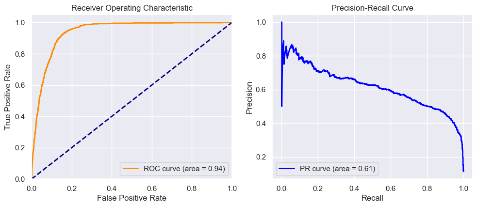

# Bank Marketing Term Deposit Subscription Prediction

## Project Overview

This project aims to predict whether a customer will subscribe to a term deposit based on data from a bank's marketing campaign. Using machine learning techniques, we analyze customer data and campaign outcomes to build predictive models for binary classification.

## Key Features

- **Exploratory Data Analysis (EDA)**: Identifying patterns and insights within the data.
- **Data Preprocessing**: Handling missing values, encoding categorical variables, and applying feature scaling.
- **SMOTE**: Using the Synthetic Minority Over-sampling Technique to address class imbalance.
- **Multiple Classifiers**: Implementing various models such as Logistic Regression, Random Forest, Decision Tree, Gradient Boosting, and XGBoost.
- **Model Evaluation**: Performing cross-validation with StratifiedKFold and evaluating models using accuracy, precision, recall, and F1-score.
- **Hyperparameter Tuning**: Utilizing GridSearchCV and RandomizedSearchCV to optimize model performance.
- **Decision-making**: Outputting predictions as either "yes" or "no" for term deposit subscription.
- **Model Optimization with Advanced Algorithms**: Implementing techniques such as Voting Classifier, Stacking Classifier, and Simple Blending to improve performance.
- **Deep Learning**: Incorporating an Artificial Neural Network (ANN) model for enhanced predictions.
- **Deployment**: Deploying a web-based interface for model predictions using a Flask app, integrated with Hugging Face for model hosting.

## Data

The dataset used in this project is obtained from the [UCI Machine Learning Repository](https://archive.ics.uci.edu/ml/datasets/bank+marketing).

### Features:

- **Age**: Age of the customer.
- **Job**: Type of job.
- **Education**: Education level.
- **Contact**: Contact communication type.
- Poutcome: Outcome of the previous marketing campaign.
- **Duration**: Last contact duration.
- **Campaign**: Number of contacts during this campaign.
- **Pdays**: Days since the customer was last contacted.
- **Previous**: Number of contacts performed before this campaign.
- **emp_var_rate**: Employment variation rate.
- **cons_price_idx**: Consumer price index.

The target variable is `y`, which indicates whether the client subscribed to a term deposit:

- **1**: Yes
- **0**: No

Tools and Libraries

- **Data Manipulation**: Pandas, Numpy
- **Statistical Analysis**: SciPy
- **Outlier Handling**: Feature-engine
- **Balancing Data**: Imblearn (SMOTE)
- **Visualization**: Matplotlib, Seaborn
- **Machine Learning Models**: Scikit-learn, XGBoost, TensorFlow (Keras)
- **Deployment**: Flask, Hugging Face

## Machine Learning Workflow

1. **Data Preprocessing**:

   - Handling missing values and encoding categorical features using `OneHotEncoder` or `LabelEncoder`.
   - Feature scaling using `StandardScaler`.

2. **Modeling**:

   - Applying several models like Logistic Regression, Decision Tree, Random Forest, Gradient Boosting, and XGBoost.
   - Addressing class imbalance using **SMOTE**.

3. **Model Evaluation**:

   - Evaluating models using cross-validation with **StratifiedKFold**.
   - Using metrics like accuracy, precision, recall, and F1-score.

4. **Hyperparameter Tuning**:

   - Tuning hyperparameters using **GridSearchCV** and **RandomizedSearchCV** for selected models.

5. **Deployment**:
   - Deploying the final model with **Flask** to create a simple prediction app. and hugging face the same way.

## Installation

To run this project locally, follow these steps:

1. Clone the repository:

   ```bash
   git clone https://github.com/Akbar-fitriawan/bank-marketing-prediction.git
   cd bank-marketing-prediction
   ```

2. Install the required dependencies:
   ```bash
   pip install -r requirements.txt
   ```

### Prerequisites:

Make sure you have Python 3.8+ installed. Key libraries include:

```bash
# requirement.txt
pandas
numpy
seaborn
matplotlib
scikit-learn
feature-engine
xgboost
imblearn
tensorflow
Flask
shap
scikeras
```

## Usage

After setting up the environment, you can run the model training and evaluation with the following command:

**Compare all process**

```bash
python src/main.py
```

**Training and tuning model**

```bash
python src/model_trainer.py
```

**Playground**

- Run Flask App

  - To use the deployed model for prediction, run the Flask app.

  ```bash
  python app.py
  ```

  - Open your browser and go to `http://localhost:5000/predictdata` to access the web interface.

- Run Hugging face

  - Open your browser and go to `https://huggingface.co/spaces/Afitriawan/bank-marketing` and try it.

## Model Evaluation

Model Evaluation
The best-performing model was XGBoost, achieving:

Accuracy: 89%  
Precision: 91%  
Recall: 89%  
F1-score: 90%

The optimized Stacking Classifier achieved 90% accuracy.

Note : the ann model has sufficient performance so it is not included in the deploy model

### Confusion Matrix

The confusion matrix for the best model is shown below:

_Supervised model_


_Stacking model_


### Classification Report

_Supervised model_


_Stacking model_


### ROC curve and Precision curve

_Supervised model_


_Stacking model_



## Contributing

Contributions are welcome! Please feel free to submit a Pull Request.

## References

[UCI Machine Learning Repository: Bank Marketing Dataset](https://archive.ics.uci.edu/ml/datasets/bank+marketing)

## License

This project is licensed under the MIT License - see the [LICENSE](LICENSE) file for details.
